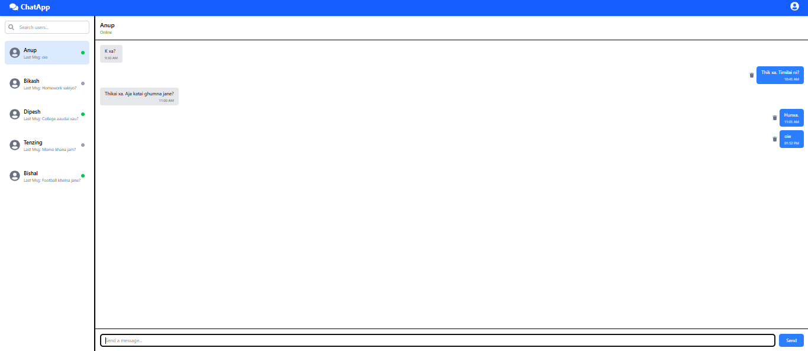

# 💬 Chat App

A modern and responsive chat application built with React and Tailwind CSS. Users can switch between conversations, send messages, and manage chats through a clean and intuitive interface.

## ✨ Features

- 💬 Real-time style chat interface
- 👥 Multiple chat conversations
- 📨 Send messages
- 🗑️ Delete messages
- 🔍 Search conversations
- 📱 Responsive and clean UI
- ⚛️ Built using reusable React components

## 🛠️ Technologies Used

- React
- JavaScript (ES6+)
- Tailwind CSS
- Vite

## 🚀 Installation

```bash
git clone https://github.com/sam123227/msgflow-chat-app.git
cd msgflow-chat-app
npm install
npm run dev
```

## 📸 Screenshot




## 🎯 Learning Outcomes

- React component architecture
- State management with Hooks
- Props and event handling
- Dynamic rendering
- Responsive UI design
- Chat interface design

## 👨‍💻 Author

**Samir**
